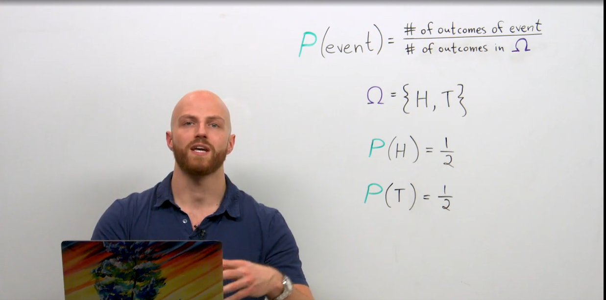

# Probability

#### Probability

probability is the theoretical study of measuring certainty that an event will happen.

P =  Number of favorable events / All possible events

<figure><figcaption></figcaption></figure>

<figure><figcaption></figcaption></figure>



Probability theory deals with predicting the confidence for the future events.

Will my bus will be late?

The most popular way to express probability is as a percentage, as in “There is a 70% chance my bus will be late.” We will call this probability P(X), where _X_ is the event of interest.

P(X) = 0.7

Probability is about quantifying predictions of events yet to happen

probability theory enables models of future non-deterministic events based on historical data

### Probability Versus Statistics

Sometimes people use the terms _probability_ and _statistics_ interchangeably, and while it is understandable to conflate the two disciplines, they do have distinctions. _Probability_ is purely theoretical of how likely an event is to happen and does not require data. _Statistics_, on the other hand, cannot exist without data and uses it to discover probability and provides tools to describe data.

Think of predicting the outcome of rolling a 4 on a die (that’s the singular of dice). Approaching the problem with a pure probability mindset, one simply says there are six sides on a die. We assume each side is equally likely, so the probability of getting a 4 is 1/6, or 16.666%.

However, a statistician might say, “No! We need to roll the die to get data. If we can get 30 rolls or more, and the more rolls we do the better, only then will we have data to determine the probability of getting a 4.” This approach may seem silly if we assume the die is fair, but what if it’s not? If that’s the case, collecting data is the only way to discover the probability of rolling a 4.

#### Marginal probability

When we work with a single probability of an event P(X), known as a _marginal probability._

### Conditional probability

Conditional probability P(Y | X).

used in machine learning classification.

example image classifying algorithms try to predict the what is input image class.

Y -> represent the number of classes

X -> represent the input image

<figure><figcaption></figcaption></figure>



**Learning algorithms will make decisions using probability ex: information gain**

Bayesian vs Frequentist approach
