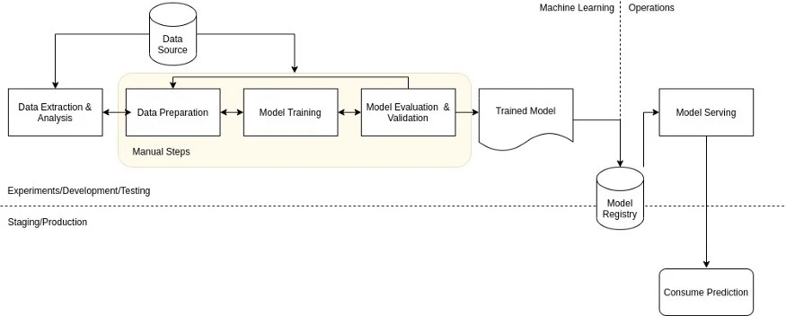

# MLOps

[https://addepto.com/blog/mlops-what-is-it-and-how-to-implement-it/](https://addepto.com/blog/mlops-what-is-it-and-how-to-implement-it/)

The goal of MLOps is to reduce technical friction to get the model from an idea into production in the shotest possible time with a little risk as possible. (Implementing DevOps for the Machine learing)

MLOps is an ML engineering culture that includes following practise

1. **Continuous Integration**
2. **Continuous deployment**
3. **Continuous Training**
4. **continuous Monitoring**

## ML or Data science life cycle

The ML or Data science work starts from business' problem. Next step is collecting data, then after that model building testing the model and deployment of the model. Continously monitor the model if the model performace not meeting the client expectation (not solving the busineers problem) retrain the model.

<figure><figcaption></figcaption></figure>



## How model depricted over a time?

Example Share market forecasting model failed during Covid19.

the model builded on last 4 years of Historical data, during covid19 jun 2020 data distribution changed, model didn't work well. data changes model performance also not good

## Model retraining

Another example banks fraud transaction prediction?

We build a model for predicting fraud transaction, our model will have range and other factors considered to predict fraud or non fraud transaction.

If my model predict out of 8 time is 5 time is actual fraud and other 3 times its not  predicting well customer will complain to banks, banks people need to retrain the model.

## MLOps lifecycle

<figure><figcaption>
<a href="https://addepto.com/blog/mlops-what-is-it-and-how-to-implement-it/">https://addepto.com/blog/mlops-what-is-it-and-how-to-implement-it/</a> 
</figcaption></figure>

MLOPs operations



<figure><figcaption></figcaption></figure>

